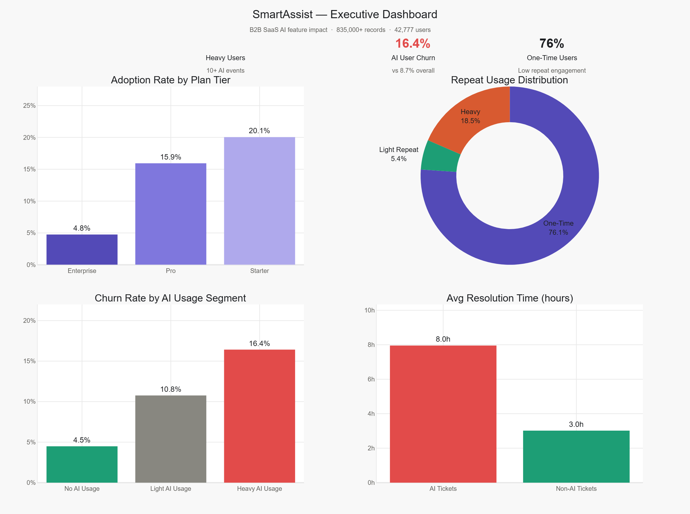

# 🤖 SmartAssist AI — Feature Impact & Business Value Analysis


---

## 📌 Project Overview

This project analyzes the real-world business impact of **SmartAssist**, an AI-powered copilot feature within a B2B SaaS project management platform ("TaskFlow"). Using ~835,000+ records across 4 datasets, we evaluate adoption rates, user retention, churn correlation, and support cost impact.

---

## 🔍 Key Findings

| Metric | Value |
|--------|-------|
| Overall Adoption Rate | **12.8%** (5,472 of 42,777 users) |
| Starter Tier Adoption | **20.0%** |
| Pro Tier Adoption | **15.9%** |
| Enterprise Tier Adoption | **4.7%** |
| One-Time Users | **76%** |
| Heavy Users (10+ events) | **18%** |
| Heavy AI User Churn Rate | **16.4%** vs 8.7% overall (~1.9×) |

---

## 📊 Executive Dashboard



---

## 🗂️ Project Structure
```
SmartAssist-AI-Impact-Analysis/
├── README.md
├── requirements.txt
├── .gitattributes
├── data/
│   ├── feature_events.csv      # 564 MB — Git LFS tracked
│   ├── subscriptions.csv       # Git LFS tracked
│   ├── support_tickets.csv     # Git LFS tracked
│   └── users.csv               # Git LFS tracked
├── notebooks/
│   └── analysis.ipynb          # Complete 7-phase analysis
└── outputs/
    └── executive_dashboard.png # Final dashboard visualization
```

---

## 🔧 Setup & Installation

### Prerequisites
- Python 3.8+
- [Git LFS](https://git-lfs.github.com/) (required for data files)

### Steps
```bash
# 1. Install Git LFS (if not already installed)
# macOS:
brew install git-lfs
# Ubuntu/Debian:
sudo apt-get install git-lfs
# Windows: Download from https://git-lfs.github.com/

# 2. Initialize Git LFS
git lfs install

# 3. Clone the repository
git clone https://github.com/Nikita-Dongre/SmartAssist-AI-Impact-Analysis.git
cd SmartAssist-AI-Impact-Analysis

# 4. Create a virtual environment
python -m venv venv
source venv/bin/activate  # On Windows: venv\Scripts\activate

# 5. Install dependencies
pip install -r requirements.txt

# 6. Launch Jupyter
jupyter notebook notebooks/analysis.ipynb
```

> ⚠️ **Note:** If you see small pointer files instead of actual CSVs, run `git lfs pull` to download the full data.

---

## 📈 Analysis Phases

| Phase | Description |
|-------|-------------|
| 1. Data Exploration & Cleaning | Load 4 datasets, normalize feature names, filter SmartAssist events |
| 2. Adoption Rate | Calculate overall and per-tier SmartAssist adoption |
| 3. Tier Segmentation | Break down usage by Starter / Pro / Enterprise plans |
| 4. Repeat Usage | Classify users as One-Time, Light Repeat, or Heavy |
| 5. Churn Correlation | Compare churn rates across AI usage segments |
| 6. Support Cost Impact | Analyze resolution time and CSAT for AI-related tickets |
| 7. Executive Dashboard | 4-panel visualization summarizing key insights |

---

## 🛠️ Tech Stack

| Tool | Purpose |
|------|---------|
| Python (pandas, numpy) | Data wrangling & analysis |
| Plotly | Interactive charts & dashboard |
| Matplotlib, Seaborn | Supporting visualizations |
| Kaleido | Export dashboard as PNG |
| Jupyter Notebook | Interactive analysis environment |
| Git LFS | Large file storage for datasets |

---

## 📝 License

This project was created for **portfolio and educational purposes** by Nikita Dongre.
The code and analysis are free to view and reference, but please do not copy or redistribute without credit.

---

## 👩‍💻 Author

**Nikita Dongre**
- GitHub: [@Nikita-Dongre](https://github.com/Nikita-Dongre)
